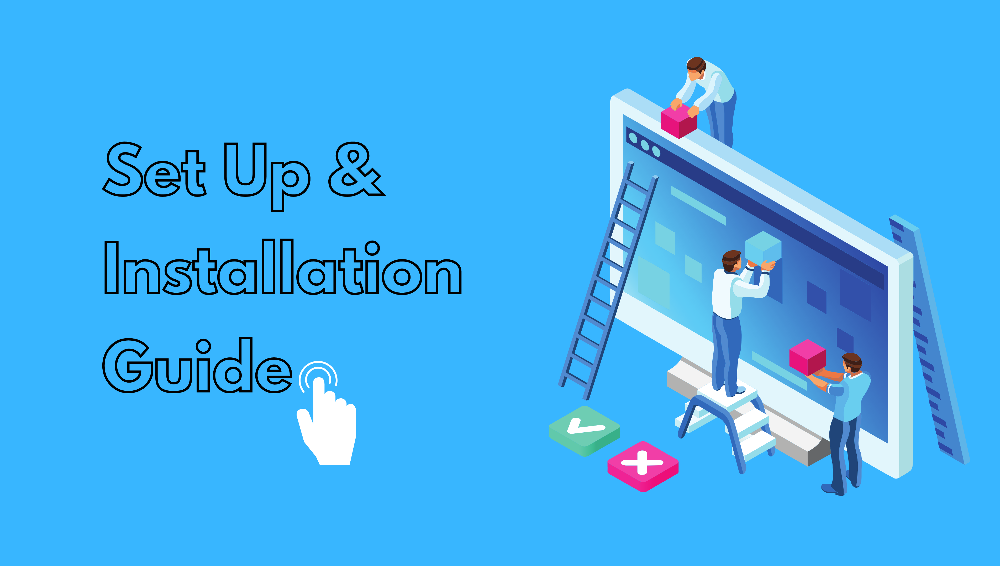

# Chess

## Dependencies
* SDL2
* SDL2_image, SDL2_mixer, SDL2_ttf

### How to use this? 🛠
Click on the image below for set up and usage guide.

### Developers
1. Suban Shrestha 076BCT082 ([@suban244](https://github.com/suban244))
2. Yunika Bajracharya 076BCT095 ([@Yunika-Bajracharya](https://github.com/Yunika-Bajracharya))
3. Prabin Shrestha 076BCT067 ([@shresprbn](https://github.com/shresprbn))
