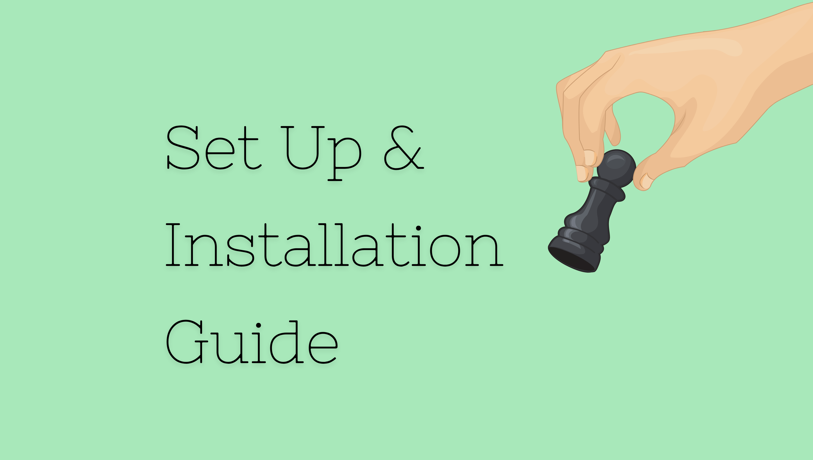

# Chess
Amid the virtual education, quarantine, and social distancing due to COVID-19, playing online games has been a healthy escape for us. With Chess being one of the most favorite online games played among the students, we thought - why not create our own online chess game for fun recreation and social engagement? Here is our attempt.

## Technical Documentation 
[Project Report](https://github.com/Yunika-Bajracharya/Chess/blob/main/Project_Report.pdf)

## Dependencies
* SDL2
* SDL2_image, SDL2_mixer, SDL2_ttf

## How to use this? 🛠
Click on the image below for set up and usage instructions!

## Screenshots

<table>
  <tr>
    <td>Menu</td>
     <td>Check</td>
     <td>Checkmate</td>
  </tr>
  <tr>
    <td></td>
    <td></td>
    <td></td>
  </tr>
  <tr>
    <td>Black resigns</td>
     <td>White resigns</td>
     <td>Time up</td>
  </tr>
  <tr>
    <td></td>
    <td></td>
    <td></td>
  </tr>
 </table>

## Developers
1. Suban Shrestha 076BCT082 ([@suban244](https://github.com/suban244))
2. Yunika Bajracharya 076BCT095 ([@Yunika-Bajracharya](https://github.com/Yunika-Bajracharya))
3. Prabin Shrestha 076BCT067 ([@shresprbn](https://github.com/shresprbn))
